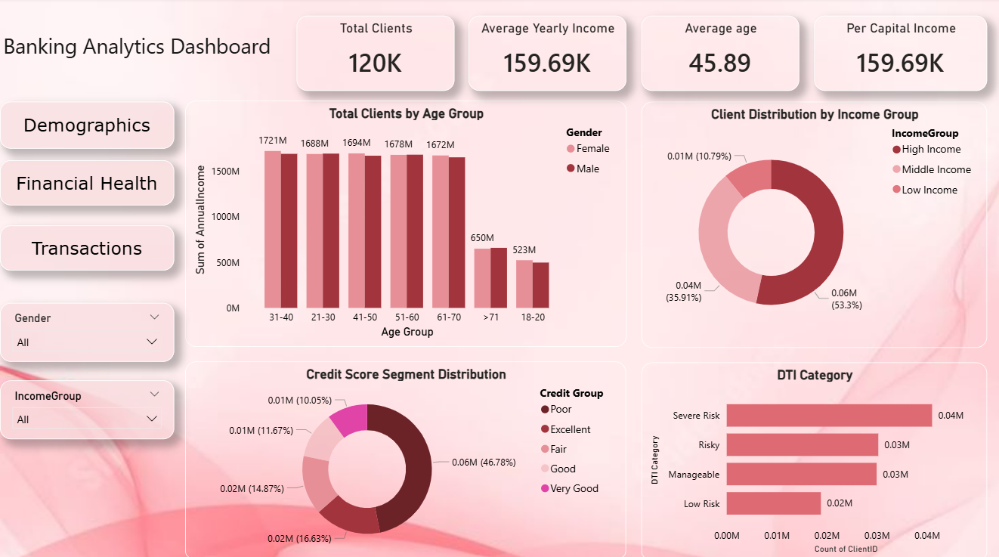
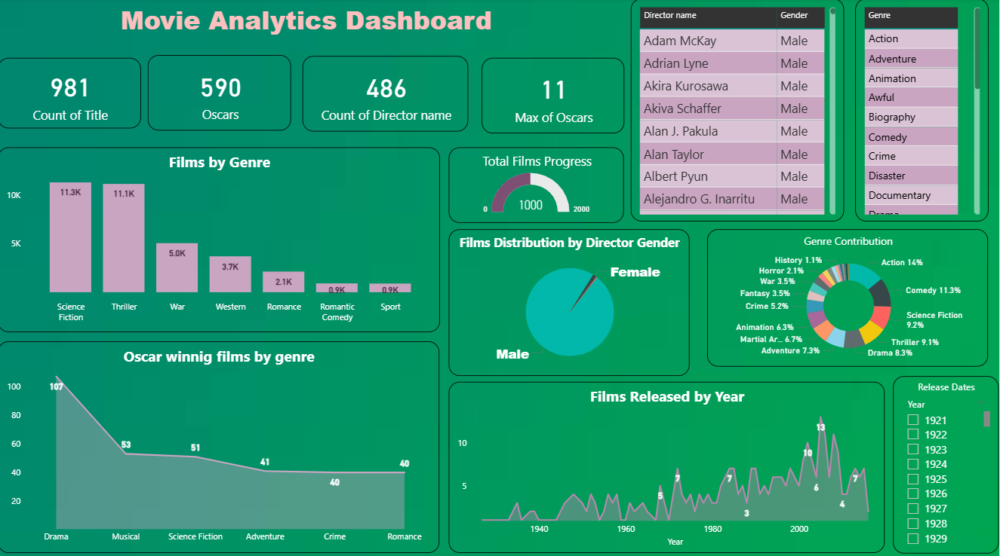
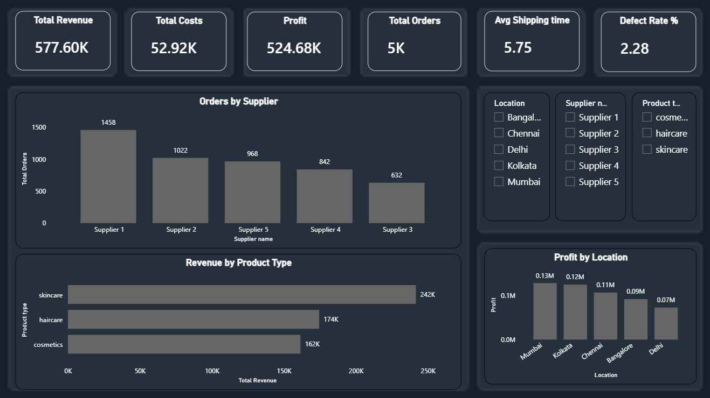

# 👋 Hi, I'm Shruti Upadhyay

💻 Data Analyst with a growing interest in data analysis and visualization

📊 I work with data to uncover insights and present them in a clear, meaningful way

## 👩‍💼 About Me

I enjoy working with data and turning raw information into meaningful insights that support better decision-making.
My journey started with Excel and gradually expanded to SQL, Python, and Power BI, where I analyze datasets and build interactive dashboards.

I like exploring patterns, understanding trends, and presenting data in a simple and clear way.
My focus is on developing strong analytical thinking and solving problems using data.

## 🛠 Skills Summary

| Category        | Skills                                                                                                                                                                                                  |
| --------------- | ------------------------------------------------------------------------------------------------------------------------------------------------------------------------------------------------------- |
| Languages       | Python, SQL                                                                                                                                                                                             |
| Analytics Tools | Power BI, Excel                                                                                                                                                                                         |
| Databases       | MySQL                                                                                                                                                                                                   |
| Core Skills     | Data Cleaning, Data Analysis, Data Visualization, Exploratory Data Analysis (EDA), Dashboard Development, Data Interpretation, KPI Design, Data Modeling, Basic ETL, Problem Solving, Critical Thinking |

## 📊 Featured Projects

<table>
<tr>
<td width="50%" valign="top">

### 🏦 Banking Analytics Dashboard

A Power BI dashboard built to analyze banking customer data including demographics, financial health, and transaction behavior.
It highlights key metrics like client distribution, income segmentation, and credit insights to support better decision-making.

📌 <a href="https://github.com/shruti-upadhyay/banking-analytics-dashboard">View Project</a>

</td>

<td width="50%" align="center">

</td>
</tr>
</table>

<table>
<tr>

<td width="50%" align="center">

</td>

<td width="50%" valign="top">

### 🎬 Movie Analytics Dashboard

This project explores movie datasets to understand trends across genres, directors, and award-winning films.
It highlights genre popularity, film production trends, and release patterns using interactive Power BI dashboards.

📌 <a href="https://github.com/shruti-upadhyay/movie-analytics-dashboard">View Project</a>

</td>
</tr>
</table>

<table>
<tr>
<td width="50%" valign="top">

### 🚚 Supply Chain Analysis

A dashboard focused on analyzing supply chain performance including revenue, profit, orders, and shipping time.
It helps identify supplier performance, product trends, and location-based insights to improve operations.

📌 <a href="https://github.com/shruti-upadhyay/Supply-Chain-Analysis">View Project</a>

</td>

<td width="50%" align="center">

</td>
</tr>
</table>

<table>
<tr>

<td width="50%" align="center">

</td>

<td width="50%" valign="top">

### 📱 Social Media Screen Time Analysis

This project analyzes user screen time behavior using Python, SQL, and Power BI.
It focuses on identifying usage patterns and understanding digital habits through interactive dashboards.

📌 <a href="https://github.com/shruti-upadhyay/social-media-screen-time-analysis">View Project</a>

</td>
</tr>
</table>

<table>
<tr>
<td width="50%" valign="top">

### 👥 HR Analytics Dashboard

A Power BI dashboard designed to analyze employee data including attrition, salary distribution, and job roles.
It provides insights into workforce trends and supports data-driven HR decision-making.

📌 <a href="https://github.com/shruti-upadhyay/HR-Analytics-Dashboard">View Project</a>

</td>

<td width="50%" align="center">

</td>
</tr>
</table>

## 📫 Let's Connect

📩 Email: <a href="mailto:shrutiupadhyay601@gmail.com">[shrutiupadhyay601@gmail.com](mailto:shrutiupadhyay601@gmail.com)</a>

🔗 LinkedIn: <a href="https://www.linkedin.com/in/shruti-upadhyay-7460b62a8/">Shruti Upadhyay</a>

